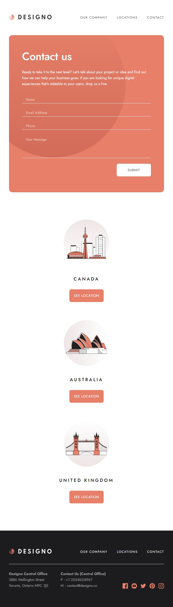

# Designo

This is a demo project - Designo multi-page website

## Table of contents

- [Overview](#overview)
  - [The project](#the-project)
  - [Screenshots](#screenshots)
- [My process](#my-process)
  - [Built with](#built-with)
  - [What I learned](#what-i-learned)
- [Author](#author)

## Overview

### The project

Users should be able to:

- View the optimal layout for each page depending on their device's screen size
- See hover states for all interactive elements throughout the site
- Receive an error message when the contact form is submitted if:
  - The `Name`, `Email Address` `Phone` or `Your Message` fields are empty
  - The `Email Address` is not formatted correctly

### Screenshots

- Desktop - Home

  

- Desktop - App Design Page

  

- Tablet - Contact

  

- Mobile - Home

  

- Mobile - Graphic Design Page

  

- Mobile - Menu

  

## My process

### Built with

- [React](https://react.dev/) - UI library
- [Next.js](https://nextjs.org/) - React metaframework
- [Sass/Scss](https://sass-lang.com/) - For styles
- [CSS-Modules](https://github.com/css-modules/css-modules) - For component-level CSS styles
- [Radix UI](https://www.radix-ui.com/) - A modal component with accessibility
- CSS Flexbox
- CSS Grid

### What I learned

While working through this project, I wrapped and created some reusable UI components like Card and SuperLink, making the codebase more readable and maintainable.

```js
function SuperLink({
  className = '',
  type,
  height,
  bgImageUrl,
  linkURL = '/',
}) {
  const linkClassname = `${styles.linkwrapper} ${className}`;
  const designStyle = {
    height: `${height}px`,
    backgroundImage: 'url(' + bgImageUrl + ')',
  };
  const floatingStyle = { height: `${height}px` };

  return (
    <Link href={linkURL} className={linkClassname}>
      <div style={designStyle} className={styles.designwrapper}></div>
      <div style={floatingStyle} className={styles.floatingwords}>
        <h2>{type} Design</h2>
        <div>
          <p>View Projects</p>
          <ArrowIcon />
        </div>
      </div>
    </Link>
  );
}

export default SuperLink;
```

## Author

- Website - [Jett Zhang](https://github.com/seamissu)
